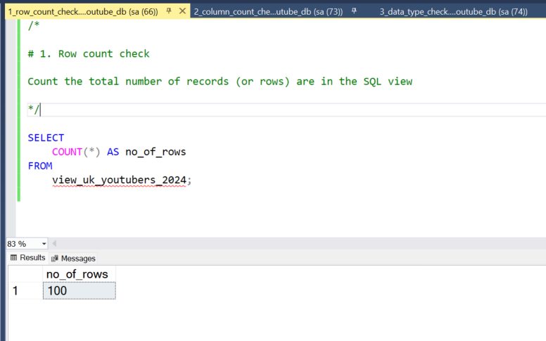

# Data Portfolio


# Header

## Subheader


# Table of contents


# Objective
   * What is the key point?
     
 The Head of Marketing wants to find out who the top YouTubers are in 2024 to decide on which YouTubers would be best to run marketing campaigns 
 throughout the rest of the year.

   * What is the ideal solution?
     
 To create a dashboard that provides insights into the top UK YouTubers in 2024 that includes their

   * subscriber count
   *total views
   *total videos, and
   *engagement metrics

This will help the marketing team make informed decisions about which YouTubers to collaborate with for their marketing campaigns.

## User story

As the Head of Marketing, I want to use a dashboard that analyses YouTube channel data in the UK .

This dashboard should allow me to identify the top performing channels based on metrics like subscriber base and average views.

With this information, I can make more informed decisions about which Youtubers are right to collaborate with, and therefore maximize how effective each marketing campaign is.

# Data source

   *What data is needed to achieve our objective?
   
We need data on the top UK YouTubers in 2024 that includes their

   * channel names

   * total subscribers

   * total views

   * total videos uploaded

   * Where is the data coming from? The data is sourced from Kaggle (an Excel extract), [see here to find it.](https://www.kaggle.com/datasets/bhavyadhingra00020/top-100-social-media-influencers-2024-countrywise?resource=download)

# Stages

   * Design
   * Developement
   * Testing
   * Analysis

# Design

## Dashboard components required

   * What should the dashboard contain based on the requirements provided?
To understand what it should contain, we need to figure out what questions we need the dashboard to answer:

   1. Who are the top 10 YouTubers with the most subscribers?
   2. Which 3 channels have uploaded the most videos?
   3. Which 3 channels have the most views?
   4. Which 3 channels have the highest average views per video?
   5. Which 3 channels have the highest views per subscriber ratio?
   6. Which 3 channels have the highest subscriber engagement rate per video uploaded?
For now, these are some of the questions we need to answer, this may change as we progress down our analysis.

# Dashboard mockup

   * What should it look like?
Some of the data visuals that may be appropriate in answering our questions include:

   * Table
   * Treemap
   * Scorecards
   * Horizontal bar chart
     


# Tools

Tool       | Purpose                                                   |
---------- | ----------------------------------------------------------
Excel      | Exploring the data                                        | 
SQL Server | Cleaning, testing, and analyzing the data                 |
Power BI   | SQL Server   | Cleaning, testing, and analyzing the data  |
GitHub     | SQL Server   | Cleaning, testing, and analyzing the data  |
Mokkup AI  | Designing the wireframe/mockup of the dashboard           |

# Development

## Pseudocode

   * What's the general approach in creating this solution from start to finish?
   * Get the data
   *Explore the data in Excel
   *Load the data into SQL Server
   *Clean the data with SQL
   *Test the data with SQL
   *Visualize the data in Power BI
   *Generate the findings based on the insights
   *Write the documentation + commentary
   *Publish the data to GitHub Pages

# Data exploration notes

This is the stage where you have a scan of what's in the data, errors, inconcsistencies, bugs, weird and corrupted characters etc

   * What are your initial observations with this dataset? What's caught your attention so far?
   1. There are at least 4 columns that contain the data we need for this analysis, which signals we have everything we need from the file 
      without needing to contact the client for any more data.
   2. The first column contains the channel ID with what appears to be channel IDS, which are separated by a @ symbol - we need to extract the 
      channel names from this.
   3. Some of the cells and header names are in a different language - we need to confirm if these columns are needed, and if so, we need to 
      address them.
   4. We have more data than we need, so some of these columns would need to be removed

# Data cleaning

   * What do we expect the clean data to look like? (What should it contain? What contraints should we apply to it?)
     
The aim is to refine our dataset to ensure it is structured and ready for analysis.

The cleaned data should meet the following criteria and constraints:

   * Only relevant columns should be retained.
   * All data types should be appropriate for the contents of each column.
   * No column should contain null values, indicating complete data for all records.
     
Below is a table outlining the constraints on our cleaned dataset:

Property           | Description |
------------------ | -------------
Number Of Rows     | 100         |
Number Of Columns  | 4           |

And here is a tabular representation of the expected schema for the clean data:

| Column Name       | Data Type  | Nullable |
|-------------------|------------|----------|
| channel_name      | VARCHAR    | NO       |
| total_subscribers | INTEGER    | NO       |
| total_views       | INTEGER    | NO       |
| total_videos      | INTEGER    | NO       |

   * What steps are needed to clean and shape the data into the desired format?
   1. Remove unnecessary columns by only selecting the ones you need
   2. Extract Youtube channel names from the first column
   3. Rename columns using aliases

## Transform the data

```sql
/*
# 1. Select the required columns
# 2. Extract the channel name from the 'NOMBRE' column
*/

-- 1.
SELECT
    SUBSTRING(NOMBRE, 1, CHARINDEX('@', NOMBRE) -1) AS channel_name,  -- 2.
    total_subscribers,
    total_views,
    total_videos

FROM
    top_uk_youtubers_2024

```

## Create the SQL view

```sql
/*
# 1. Create a view to store the transformed data
# 2. Cast the extracted channel name as VARCHAR(100)
# 3. Select the required columns from the top_uk_youtubers_2024 SQL table 
*/

-- 1.
CREATE VIEW view_uk_youtubers_2024 AS

-- 2.
SELECT
    CAST(SUBSTRING(NOMBRE, 1, CHARINDEX('@', NOMBRE) -1) AS VARCHAR(100)) AS channel_name, -- 2. 
    total_subscribers,
    total_views,
    total_videos

-- 3.
FROM
    top_uk_youtubers_2024
```

# Testing

   * What data quality and validation checks are you going to create?
Here are the data quality tests conducted:

## Row count check

### SQL querry

```sql
/*
# Count the total number of records (or rows) are in the SQL view
*/

SELECT
    COUNT(*) AS no_of_rows
FROM
    view_uk_youtubers_2024;

```

### Output



## Column count check

### SQL querry

```sql
/*
# Count the total number of columns (or fields) are in the SQL view
*/


SELECT
    COUNT(*) AS column_count
FROM
    INFORMATION_SCHEMA.COLUMNS
WHERE
    TABLE_NAME = 'view_uk_youtubers_2024'
```

### Output


## Data type check

### SQL querry

```sql
/*
# Check the data types of each column from the view by checking the INFORMATION SCHEMA view
*/

-- 1.
SELECT
    COLUMN_NAME,
    DATA_TYPE
FROM
    INFORMATION_SCHEMA.COLUMNS
WHERE
    TABLE_NAME = 'view_uk_youtubers_2024';
```
### Output


## Duplicate count check

### SQL querry

```sql
/*
# 1. Check for duplicate rows in the view
# 2. Group by the channel name
# 3. Filter for groups with more than one row
*/

-- 1.
SELECT
    channel_name,
    COUNT(*) AS duplicate_count
FROM
    view_uk_youtubers_2024

-- 2.
GROUP BY
    channel_name

-- 3.
HAVING
    COUNT(*) > 1;
```
### Output


## Visualisation

### Results

   * What does the dashboard look like?


## DAX Measures
### 1. Total Subscribers (M)

```dax
Total Subscribers (M) = 
VAR million = 1000000
VAR sumOfSubscribers = SUM(view_uk_youtubers_2024[total_subscribers])
VAR totalSubscribers = DIVIDE(sumOfSubscribers,million)

RETURN totalSubscribers
```

### 2. Total Views (B)

```dax
Total Views (B) = 
VAR billion = 1000000000
VAR sumOfTotalViews = SUM(view_uk_youtubers_2024[total_views])
VAR totalViews = ROUND(sumOfTotalViews / billion, 2)

RETURN totalViews

```

### 3. Total Videos

```dax
Total Videos = 
VAR totalVideos = SUM(view_uk_youtubers_2024[total_videos])

RETURN totalVideos

```

### 4. Average Views Per Video (M)

```dax
Average Views per Video (M) = 
VAR sumOfTotalViews = SUM(view_uk_youtubers_2024[total_views])
VAR sumOfTotalVideos = SUM(view_uk_youtubers_2024[total_videos])
VAR  avgViewsPerVideo = DIVIDE(sumOfTotalViews,sumOfTotalVideos, BLANK())
VAR finalAvgViewsPerVideo = DIVIDE(avgViewsPerVideo, 1000000, BLANK())

RETURN finalAvgViewsPerVideo 

```

### 6. Views per subscriber

```dax
Views Per Subscriber = 
VAR sumOfTotalViews = SUM(view_uk_youtubers_2024[total_views])
VAR sumOfTotalSubscribers = SUM(view_uk_youtubers_2024[total_subscribers])
VAR viewsPerSubscriber = DIVIDE(sumOfTotalViews, sumOfTotalSubscribers, BLANK())

RETURN viewsPerSubscriber 

```


### 1. Who are the top 10 YouTubers with most subscribers?

| Rank | Channel Name             | Subscribers (M) |
|------|--------------------------|-----------------|
| 1    | NoCopyRightSounds        | 33.60           |
| 2    | DanTDM                   | 28.60           |
| 3    | Dan Rhodes               | 26.50           |
| 4    | Miss Katy                | 24.50           |
| 5    | Mister Max               | 24.40           |
| 6    | KSI                      | 24.10           |
| 7    | Jelly                    | 23.50           |
| 8    | Dua Lipa                 | 23.30           |
| 9    | Sidemen                  | 21.00           |
| 10   | Ali-A                    | 18.90           |


### 2. Which 3 channels have uploaded the most videos

| Rank | Channel Name             | Videos Uploaded |
|------|--------------------------|-----------------|
| 1    | GRM Daily                | 14,696          |
| 2    | Manchester City          | 8,248           |
| 3    | Yogscast                 | 6,435           |
